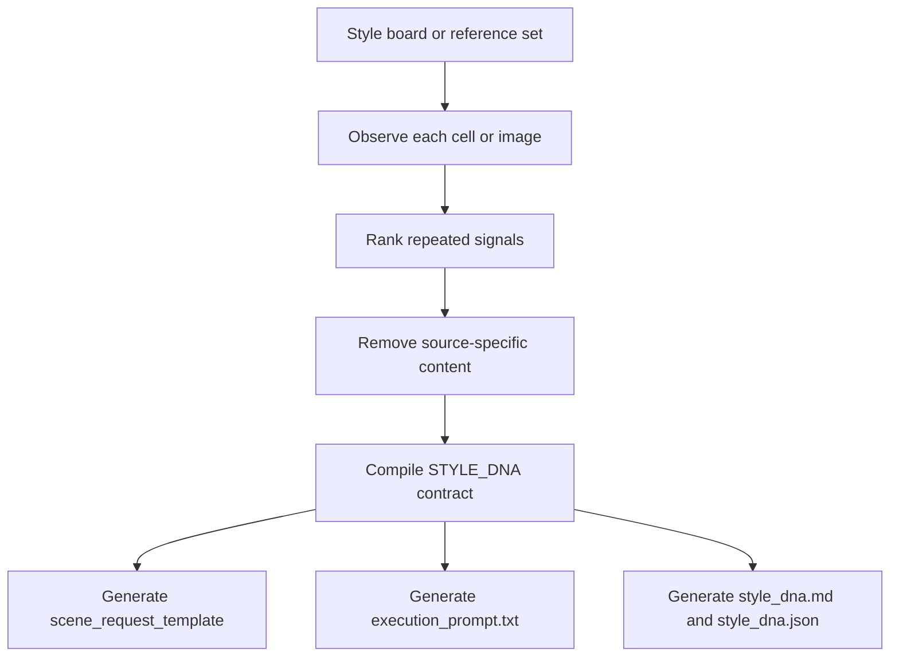

# Style DNA Prompt Skill

Compile a style board into a reusable Style DNA contract for GPT Image, Nano Banana, or similar black-box image models.

This project is for people who already have a 3x3 grid, 4x4 grid, collage board, or multi-image reference set and want to preserve the visual system without copying the original subject, prop, outfit, or location. Instead of producing a loose reverse prompt, it extracts a transferable contract centered on style, emotion, and atmosphere.

## Features

- Extracts repeated visual signals from a style board before any synthesis.
- Separates transferable style mechanisms from source-specific content.
- Preserves `STYLE_DNA` as a stable contract while allowing scene swaps through `SCENE_REQUEST`.
- Produces both human-review and machine-execution artifacts.
- Supports GPT Image, Nano Banana, and platform-neutral prompt workflows.

## Project Structure

```bash
git clone https://github.com/susu177990-rgb/style-dna-prompt-skill.git
cp -R "style dna prompt skill" ~/.codex/skills/style-dna
```

```text
.
├── SKILL.md
├── README.md
├── agents/openai.yaml
├── examples/
├── references/
├── schemas/
└── tests/
```

## Installation

Place this folder in your Codex skills directory, or keep it in a project-local skills workspace.

```bash
cp -R "style dna prompt skill" ~/.codex/skills/style-dna
```

If you use project-local skills instead of global skills:

```bash
cp -R "style dna prompt skill" ./.codex/skills/style-dna
```

## Quickstart

1. Prepare one of these inputs:
   - a `3x3` or `4x4` style grid
   - a collage reference board
   - a small set of clearly same-style reference images
2. Invoke the skill with the board image and optional extra references.
3. Review the generated `STYLE_DNA` and use only `SCENE_REQUEST` for later scene changes.

Example invocation inside Codex:

```bash
$ codex
```

```text
Use $style-dna to extract a transferable Style DNA from this style board and return style_dna.md, style_dna.json, and execution_prompt.txt.
```

## Input Contract

The main input schema is defined in [`schemas/input.schema.json`](./schemas/input.schema.json).

Core fields:

- `style_board_image_url`: required main board image
- `reference_images`: optional supporting same-style images
- `target_model`: `gpt_image_or_nano_banana`, `gpt_image`, `nano_banana`, or `platform_neutral`
- `output_language`: review/output language mode
- `analysis_depth`: `compact`, `standard`, or `full`
- `scene_request_hint`: optional example scene request

## Output Artifacts

The skill is designed to return three outputs by default:

- `style_dna.md`: Chinese review document for human inspection
- `style_dna.json`: structured source of truth with analysis evidence and generation contract
- `execution_prompt.txt`: copy-ready execution prompt for image generation

It also includes a `scene_request_template` so future generations can change subject, environment, action, or framing without mutating the locked style contract.

## Common Workflow



## Usage Examples

### 1. Extract Style DNA from a grid

Use when the board already has clear style consistency.

```json
{
  "style_board_image_url": "https://example.com/style-grid.jpg",
  "target_model": "gpt_image_or_nano_banana",
  "output_language": "zh_review_en_contract",
  "analysis_depth": "standard"
}
```

### 2. Add a future scene request without changing the style contract

Use `SCENE_REQUEST` to swap content while keeping `STYLE_DNA` fixed.

```json
{
  "SCENE_REQUEST": {
    "subject": "a small silver perfume bottle",
    "environment": "an empty tiled bathroom at dusk",
    "action": "resting near a fogged mirror",
    "shot_type": "close medium product shot",
    "composition": "off-center subject with negative space",
    "aspect_ratio": "4:5",
    "output_goal": "generate a new subject while preserving the locked Style DNA"
  }
}
```

### 3. Understand the generated structure

See the bundled examples:

- [`examples/style_dna.example.json`](./examples/style_dna.example.json)
- [`examples/scene_request.example.json`](./examples/scene_request.example.json)

## Quality Rules

This skill is opinionated. It is intentionally not a generic reverse-prompt template.

- Inspect first, then choose fields dynamically.
- Do not treat one-off content as locked style.
- Keep emotion and atmosphere as concrete visual mechanisms, not vague adjectives.
- Remove exact people, outfits, props, logos, rooms, and story events by default.
- If a scene request conflicts with locked style, locked style wins unless you explicitly revise the Style DNA.

The deeper workflow and failure-prevention notes live here:

- [`references/workflow.md`](./references/workflow.md)
- [`references/ignore-retain-rules.md`](./references/ignore-retain-rules.md)
- [`references/output-contract.md`](./references/output-contract.md)
- [`references/failure-cases.md`](./references/failure-cases.md)

## Development And Validation

Read the test prompts under [`tests`](./tests) to evaluate different board types and failure modes.

Run the README audit:

```bash
ruby /Users/griffith/.codex/skills/github-readme/scripts/github_readme_audit.rb README.md --strict
```

## Contributing

Contributions should preserve the core contract:

- `STYLE_DNA` stays stable
- `SCENE_REQUEST` stays variable
- source content must not leak into locked style
- emotion and atmosphere must remain explicit

When changing schemas, examples, or workflow docs, keep them aligned with `SKILL.md`.

## License

License is not specified yet. Add a repository license file before publishing this as an open-source package with reuse rights.
