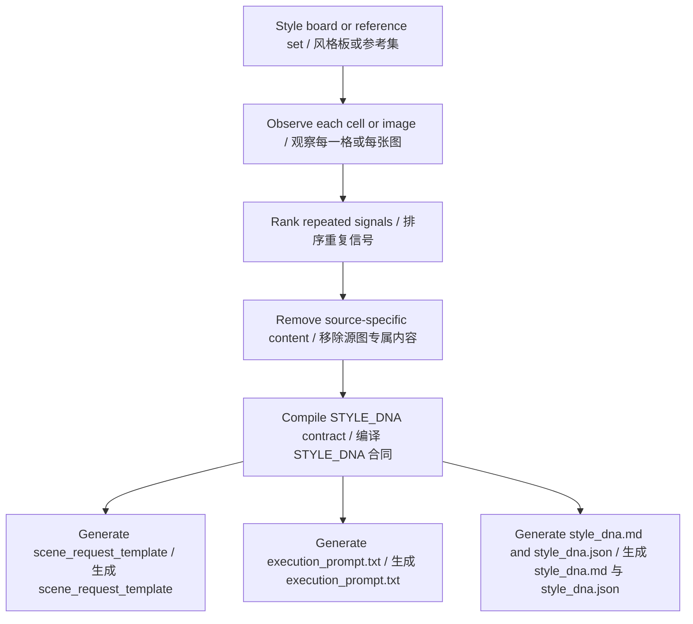

# Style DNA Prompt Skill / Style DNA 风格锁定技能

Compile a style board into a reusable Style DNA contract for GPT Image, Nano Banana, or similar black-box image models.  
把风格参考板编译成可复用的 Style DNA 合同，用于 GPT Image、Nano Banana 或类似黑盒生图模型的稳定风格生成。

This project is for people who already have a 3x3 grid, 4x4 grid, collage board, or multi-image reference set and want to preserve the visual system without copying the original subject, prop, outfit, or location. Instead of producing a loose reverse prompt, it extracts a transferable contract centered on style, emotion, and atmosphere.  
这个项目适合已经有 `3x3` / `4x4` 宫格图、拼贴参考板或多张同风格参考图的人。目标不是复制原图里的人物、道具、服装或地点，而是提炼出一个可迁移的风格合同，核心保留 `style`、`emotion` 和 `atmosphere`。

## Features

- Extracts repeated visual signals from a style board before any synthesis.  
  在做任何总结前，先拆解并提取参考板中的重复视觉信号。
- Separates transferable style mechanisms from source-specific content.  
  把可迁移的风格机制与源图专属内容严格分离。
- Preserves `STYLE_DNA` as a stable contract while allowing scene swaps through `SCENE_REQUEST`.  
  固定 `STYLE_DNA`，通过 `SCENE_REQUEST` 实现场景、主体、动作替换。
- Produces both human-review and machine-execution artifacts.  
  同时输出适合人审阅和适合模型执行的结果。
- Supports GPT Image, Nano Banana, and platform-neutral prompt workflows.  
  兼容 GPT Image、Nano Banana，以及平台中立的提示词工作流。

## Project Structure

```bash
git clone https://github.com/susu177990-rgb/style-dna-prompt-skill.git
cp -R "style dna prompt skill" ~/.codex/skills/style-dna
```

```text
.
├── SKILL.md
├── README.md
├── agents/openai.yaml
├── examples/
├── references/
├── schemas/
└── tests/
```

## Installation

Place this folder in your Codex skills directory, or keep it in a project-local skills workspace.  
把这个目录放进你的 Codex skills 目录，或者保留在项目本地的 skills 目录中。

```bash
cp -R "style dna prompt skill" ~/.codex/skills/style-dna
```

If you use project-local skills instead of global skills:  
如果你使用项目本地 skills，而不是全局 skills：

```bash
cp -R "style dna prompt skill" ./.codex/skills/style-dna
```

## Quickstart

1. Prepare one of these inputs:  
   准备以下任一输入：
   - a `3x3` or `4x4` style grid  
     `3x3` 或 `4x4` 风格宫格图
   - a collage reference board  
     拼贴式参考板
   - a small set of clearly same-style reference images  
     一组明确属于同一视觉体系的参考图
2. Invoke the skill with the board image and optional extra references.  
   用主参考图和可选补充参考图调用这个技能。
3. Review the generated `STYLE_DNA` and use only `SCENE_REQUEST` for later scene changes.  
   先审阅输出的 `STYLE_DNA`，后续换场景时只改 `SCENE_REQUEST`。

Example invocation inside Codex:  
Codex 中的调用示例：

```bash
$ codex
```

```text
Use $style-dna to extract a transferable Style DNA from this style board and return style_dna.md, style_dna.json, and execution_prompt.txt.
请使用 $style-dna 从这张风格参考板中提取可迁移的 Style DNA，并返回 style_dna.md、style_dna.json 和 execution_prompt.txt。
```

## Input Contract

The main input schema is defined in [`schemas/input.schema.json`](./schemas/input.schema.json).  
主输入结构定义在 [`schemas/input.schema.json`](./schemas/input.schema.json)。

Core fields / 核心字段：

- `style_board_image_url`: required main board image  
  主参考板图片，必填
- `reference_images`: optional supporting same-style images  
  可选补充参考图，要求同风格
- `target_model`: `gpt_image_or_nano_banana`, `gpt_image`, `nano_banana`, or `platform_neutral`  
  目标模型类型
- `output_language`: review/output language mode  
  输出语言模式
- `analysis_depth`: `compact`, `standard`, or `full`  
  分析密度
- `scene_request_hint`: optional example scene request  
  可选示例场景请求

## Output Artifacts

The skill is designed to return three outputs by default:  
默认会返回三个主要产物：

- `style_dna.md`: Chinese review document for human inspection  
  中文审阅版风格 DNA
- `style_dna.json`: structured source of truth with analysis evidence and generation contract  
  包含分析证据和生成合同的结构化 JSON 真值源
- `execution_prompt.txt`: copy-ready execution prompt for image generation  
  可直接复制用于生图的执行提示词

It also includes a `scene_request_template` so future generations can change subject, environment, action, or framing without mutating the locked style contract.  
同时还会包含 `scene_request_template`，用于后续更换主体、环境、动作或构图，而不破坏已锁定的风格合同。

## Common Workflow



## Usage Examples

### 1. Extract Style DNA from a grid / 从宫格图提取 Style DNA

Use when the board already has clear style consistency.  
适用于参考板已经具备明显风格一致性的情况。

```json
{
  "style_board_image_url": "https://example.com/style-grid.jpg",
  "target_model": "gpt_image_or_nano_banana",
  "output_language": "zh_review_en_contract",
  "analysis_depth": "standard"
}
```

### 2. Add a future scene request without changing the style contract / 不改风格合同，仅追加新场景请求

Use `SCENE_REQUEST` to swap content while keeping `STYLE_DNA` fixed.  
通过 `SCENE_REQUEST` 替换内容，同时保持 `STYLE_DNA` 不变。

```json
{
  "SCENE_REQUEST": {
    "subject": "a small silver perfume bottle",
    "environment": "an empty tiled bathroom at dusk",
    "action": "resting near a fogged mirror",
    "shot_type": "close medium product shot",
    "composition": "off-center subject with negative space",
    "aspect_ratio": "4:5",
    "output_goal": "generate a new subject while preserving the locked Style DNA"
  }
}
```

### 3. Understand the generated structure / 查看输出结构示例

See the bundled examples:  
查看仓库内置示例：

- [`examples/style_dna.example.json`](./examples/style_dna.example.json)
- [`examples/scene_request.example.json`](./examples/scene_request.example.json)

## Quality Rules

This skill is opinionated. It is intentionally not a generic reverse-prompt template.  
这个技能有明确立场，它不是通用型反推提示词模板。

- Inspect first, then choose fields dynamically.  
  先观察，再动态决定字段。
- Do not treat one-off content as locked style.  
  不要把一次性内容当成锁定风格。
- Keep emotion and atmosphere as concrete visual mechanisms, not vague adjectives.  
  `emotion` 和 `atmosphere` 必须写成具体视觉机制，而不是模糊形容词。
- Remove exact people, outfits, props, logos, rooms, and story events by default.  
  默认移除具体人物、服装、道具、Logo、房间和故事事件。
- If a scene request conflicts with locked style, locked style wins unless you explicitly revise the Style DNA.  
  如果场景请求和锁定风格冲突，默认以锁定风格为准，除非你明确要求重写 Style DNA。

The deeper workflow and failure-prevention notes live here:  
更细的流程和失败预防说明在这里：

- [`references/workflow.md`](./references/workflow.md)
- [`references/ignore-retain-rules.md`](./references/ignore-retain-rules.md)
- [`references/output-contract.md`](./references/output-contract.md)
- [`references/failure-cases.md`](./references/failure-cases.md)

## Development And Validation

Read the test prompts under [`tests`](./tests) to evaluate different board types and failure modes.  
阅读 [`tests`](./tests) 目录下的测试提示，验证不同类型参考板和失败场景。

Run the README audit:  
运行 README 审计：

```bash
ruby /Users/griffith/.codex/skills/github-readme/scripts/github_readme_audit.rb README.md --strict
```

## Contributing

Contributions should preserve the core contract:  
所有改动都应该保留以下核心合同：

- `STYLE_DNA` stays stable  
  `STYLE_DNA` 必须稳定
- `SCENE_REQUEST` stays variable  
  `SCENE_REQUEST` 必须保持可变
- source content must not leak into locked style  
  源图内容不能泄漏进 locked style
- emotion and atmosphere must remain explicit  
  emotion 和 atmosphere 必须明确可见

When changing schemas, examples, or workflow docs, keep them aligned with `SKILL.md`.  
修改 schema、示例或工作流文档时，必须与 `SKILL.md` 保持一致。

## License

License is not specified yet. Add a repository license file before publishing this as an open-source package with reuse rights.  
当前仓库还没有正式 License。在把它作为可复用开源项目发布之前，请先补充许可证文件。
